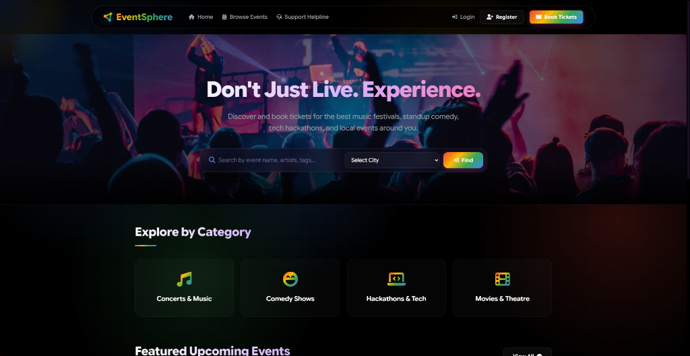
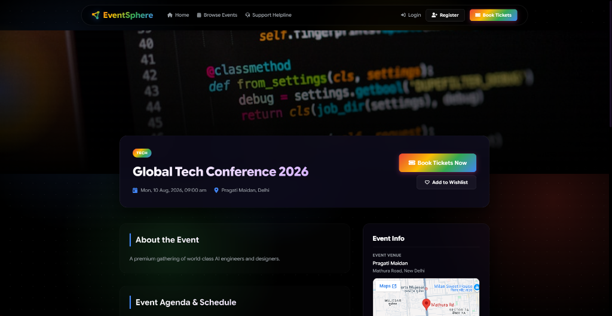
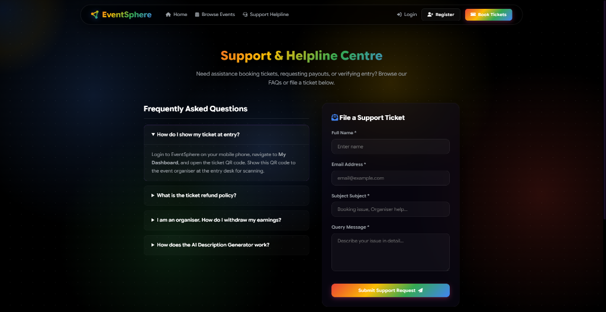
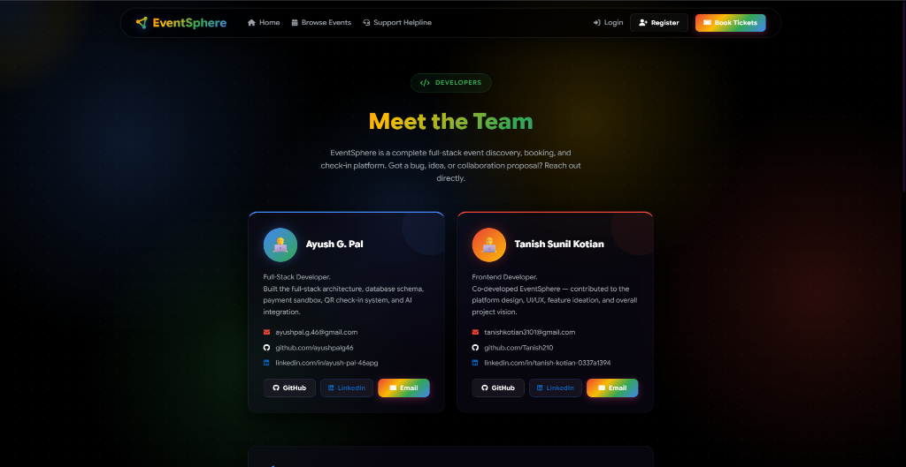

# EventSphere

A simple event booking and management platform made for students and small event organizers.
This project was created to make event discovery and ticket booking easier in one place.

🌐 **Live Website**: [https://eventsphere-f6yl.onrender.com](https://eventsphere-f6yl.onrender.com)

---

### About The Project

EventSphere is a web-based platform where users can explore events, book tickets, and manage event details easily.
The main goal of this project was to create a clean and simple platform that solves the problem of finding and managing events online.

This project helped me learn full stack web development, frontend design, backend integration, database handling, and deployment.

---

### Features

- User Registration & Login
- Browse Upcoming Events
- Event Details Page
- Ticket Booking System
- Responsive Design
- Simple and Clean UI
- Backend Database Integration
- Hosted Online using Render

---

### Tech Stack

#### Frontend
- HTML
- CSS
- JavaScript
- React.js

#### Backend
- Node.js
- Express.js

#### Database
- MongoDB

#### Deployment
- Render

---

### Screenshots

*Home Page with search filters and event categories.*

*Event details page showing event info, date, venue map, and action buttons.*

*Support & Helpline Centre with FAQ section and ticket submission form.*

*Developer profile cards for the project authors.*

---

### Learning Outcomes
 
While building this project, I learned:

- How frontend and backend connect together
- API handling
- Authentication basics
- Database operations
- Deployment process
- Debugging real project issues

---

### Future Improvements

- Payment Gateway Integration
- QR Based Ticket Verification
- Admin Dashboard
- Event Analytics
- Email Notifications
- Better UI Animations

---

### Challenges Faced

- Connecting frontend with backend
- Managing database schemas
- Fixing deployment issues
- Making the website responsive

---

### Conclusion

EventSphere is a beginner-friendly full stack project that helped me improve my development skills and understand how real-world event booking platforms work.

This project is still under development and more features will be added in the future.

---

### Author

Made by Ayush & Tanish

GitHub: [GitHub](https://github.com)
